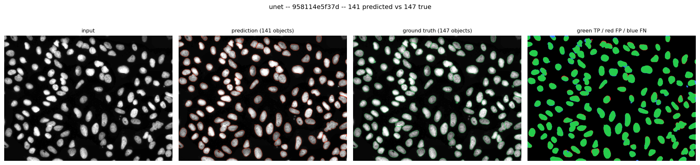
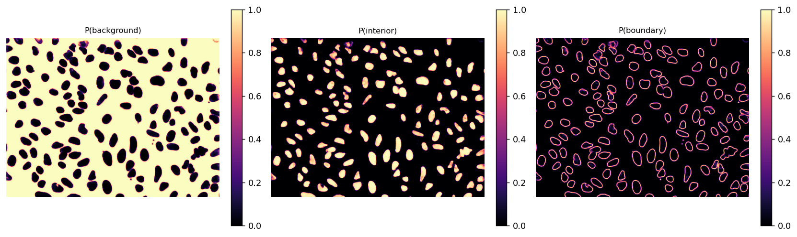
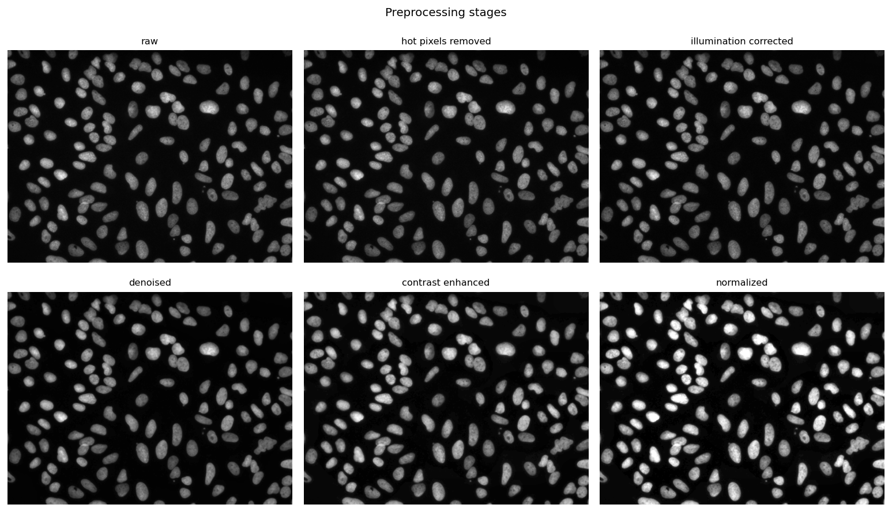
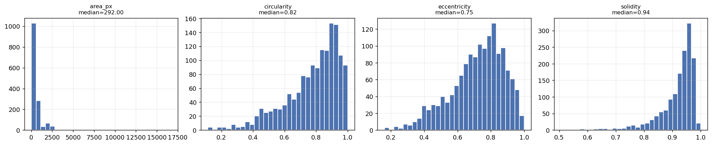
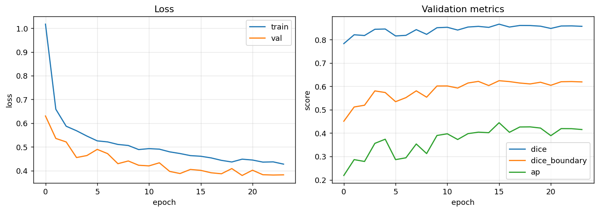

# Microscopy Image Analysis & Nuclei Instance Segmentation

An end-to-end pipeline that takes a raw microscopy field and returns
**quantitative biology**: how many nuclei, how big each one is, how irregular
its outline, how bright it is in each channel, and what its chromatin texture
looks like.

```
raw image → preprocessing → semantic segmentation → instance segmentation → per-nucleus measurements
```

Both a **classical CV baseline** (threshold → morphology → watershed) and a
**PyTorch U-Net** are implemented behind one interface, so the learned model is
measured against a real baseline rather than an absent one. Cellpose and SAM
comparisons are included as optional benchmarks.

Dataset: [BBBC038 / Data Science Bowl 2018](https://bbbc.broadinstitute.org/BBBC038)
— 670 annotated fields with per-nucleus instance masks, deliberately
heterogeneous (fluorescence, brightfield and H&E, 8 distinct image sizes, 1 to
369 nuclei per field).

---

## Results

Held-out test split (100 images never seen in training or validation). Every
backend runs the same preprocessing, the same instance stage and the same
metrics — only the segmentation step differs. Full tables, training-run details
and per-corruption numbers are in [`docs/results.md`](docs/results.md).

| Method | Dice | IoU | Precision | Recall | F1 | **AP** | Matched IoU | Count err | s/image |
|---|---|---|---|---|---|---|---|---|---|
| Classical (Otsu + watershed) | 0.865 | 0.785 | 0.699 | 0.739 | 0.707 | **0.369** | 0.775 | 9.13 | 0.18 |
| **U-Net (this project)** | **0.874** | **0.799** | **0.810** | **0.753** | **0.775** | **0.478** | **0.817** | **5.19** | 0.28 |

*100 test images. Precision/recall/F1/AP are object-wise; Dice/IoU are pixel-wise.
Count err is mean absolute error in nuclei per field.*

Comparison against external methods, on the first 50 test images (SAM on 5, as
it costs ~1 minute per field on CPU):

| Method | Dice | F1 | **AP** | Matched IoU | s/image |
|---|---|---|---|---|---|
| Classical | 0.858 | 0.688 | 0.333 | 0.759 | 0.13 |
| **U-Net (this project)** | 0.865 | 0.772 | 0.459 | 0.794 | **0.20** |
| Cellpose 3 (`nuclei`, pretrained) | **0.870** | **0.856** | **0.530** | 0.795 | 3.29 |
| SAM ViT-B, automatic | 0.656 | 0.533 | 0.260 | **0.810** | 56.06 |
| SAM ViT-B, prompted from classical seeds | 0.834 | 0.613 | 0.334 | **0.810** | 7.31 |

**Reading these numbers — three things worth pulling out:**

**1. Pixel Dice barely separates the methods; instance AP separates them
sharply.** Classical, U-Net and Cellpose sit within 0.012 Dice of each other
(0.858 / 0.865 / 0.870) while their AP spans 0.333 to 0.530 — a 59% relative
gap. The classical baseline finds roughly the right *pixels* and gets the
*object decomposition* wrong, merging touching nuclei and fragmenting textured
ones. A project reporting only Dice would conclude all three were equivalent.
This is the single clearest argument for why both metric families are reported
everywhere in this repo.

**2. Cellpose beats the custom U-Net, and that is the honest result.** It is
pretrained on far more data than BBBC038's 470 training images. The trade is
speed: the U-Net is **16x faster** (0.20 s vs 3.29 s per field on CPU) at ~1.9M
parameters, and retrains on a new assay in half an hour. Note also that Cellpose
4's `cpsam` model is *not* the one benchmarked here — it is a large transformer
that failed to finish 3 images in 30 minutes on CPU, so Cellpose 3's classic
`nuclei` model was used instead. That is itself a deployment-relevant finding.

**3. SAM has the best outlines and the worst detection.** Its matched IoU is the
highest of any method (0.810) — when it finds a nucleus, it traces it more
accurately than anything else here — yet its AP is the lowest, because being
class-agnostic it misses objects its point grid never samples and returns clumps
as single objects. Prompting it with seeds from this project's own classical
distance transform lifts Dice from 0.656 to 0.834 and makes it 7.7x faster,
which is exactly the hybrid the docs argue for: cheap classical CV for
detection, foundation model for boundaries.

### Cross-dataset (BBBC039)

The corruption sweep below perturbs held-out BBBC038 images; it is a proxy for
robustness, not a test of it. This is the test: **[BBBC039](https://bbbc.broadinstitute.org/BBBC039)**
— U2OS nuclei from a different experiment, cell line, microscope and plate. No
fine-tuning, no threshold adjustment; the checkpoint has never seen a BBBC039
pixel. **All 200 fields**, same metrics as everything above.

| Method | Dice | IoU | Precision | Recall | F1 | **AP** | Matched IoU | Count err |
|---|---|---|---|---|---|---|---|---|
| Classical | 0.924 | 0.861 | **0.762** | **0.815** | **0.785** | 0.433 | 0.819 | **10.8** |
| **U-Net** | **0.934** | **0.877** | 0.755 | 0.799 | 0.770 | **0.452** | **0.832** | 22.0 |

```bash
python scripts/evaluate_bbbc039.py --backend unet      --limit 100
python scripts/evaluate_bbbc039.py --backend unet      --limit 100 --offset 100
python scripts/evaluate_bbbc039.py --backend classical --limit 100 --config configs/classical_baseline.yaml
python scripts/evaluate_bbbc039.py --backend classical --limit 100 --offset 100 --config configs/classical_baseline.yaml
python scripts/compare_bbbc039.py   # paired stats over all 200
```

**The model transfers. Its advantage does not survive the trip.** On BBBC038's
own test split the U-Net leads the classical baseline 0.478 to 0.369 AP — a 30%
relative gap. On BBBC039 the gap is 0.452 vs 0.433, **+4.4% relative**, and
because both backends see the same fields the honest test is paired:

| Paired difference (U-Net − classical), 200 fields | Mean | 95% CI | U-Net better on |
|---|---|---|---|
| **AP** | +0.019 | **[−0.002, +0.040]** | 104 / 200 |
| F1 | −0.016 | [−0.034, +0.002] | 99 / 200 |
| Dice | +0.010 | [+0.005, +0.015] | 96 / 200 |
| Count error (lower better) | **+11.2** | **[+8.1, +14.6]** | 71 / 200 |

**The AP advantage is not distinguishable from zero** — the confidence interval
spans it, Wilcoxon gives p = 0.071, and the U-Net wins on 104 fields out of 200,
which is close to a coin toss. The count error, by contrast, is decisively
*worse*: **+11.2 nuclei per field**, well clear of zero, and worse on 121 of
200 fields against better on 71.
For the number a biologist actually reads first, the classical baseline is the
better tool on this dataset.

Neither result is noise from a lucky subset. The 200 fields split into two
well-disjoint halves — plate rows A–H and I–P, no shared wells, and since this
is a Cell Painting plate, different compound treatments — and the finding
replicates on both (U-Net AP 0.446 then 0.459; classical 0.420 then 0.446).

The reading: BBBC038 mixes fluorescence, brightfield and histology, and most of
what the U-Net learned was how to absorb that heterogeneity. BBBC039 is clean
uniform fluorescence, where a tuned Otsu is already close to the ceiling. The
learned model is not carrying a better notion of what a nucleus is — it was
carrying a better notion of *this dataset*.

**Where it actually breaks is crowding.** BBBC039 fields hold 120 nuclei on
average against BBBC038's far sparser ones. The U-Net merges dense clusters: on
the worst field it returns 82 objects where there are 154. That is the exact
failure the boundary class exists to prevent, and it does not extend to
densities outside its training range. Per-image AP runs 0.068 to 1.000, so the
mean hides a wide spread.

Note that pixel Dice — 0.934, the U-Net's best number and its only
*statistically solid* win — would tell you the model is doing fine. AP says it
is even; count error says it is worse. Same lesson the in-dataset table teaches,
reproduced on data the model was never fitted to.

Two properties of BBBC039 have to be handled or the ground truth is wrong, and
both are in `scripts/evaluate_bbbc039.py`: its masks are **graph-coloured**
rather than instance-numbered (adjacent nuclei get different small values, so a
naive `mask > 0` reads 94 objects on the first field where there are 110, and
flatters any model that under-segments), and its images are **12-bit stored in
uint16**, which dtype scaling alone leaves at 6% of range.

### Robustness

Same 25 test images under realistic corruptions, reported as Dice (AP):

| Corruption | Classical | U-Net |
|---|---|---|
| none | 0.815 (0.294) | 0.823 (0.418) |
| exposure ×0.5 | 0.729 (0.285) | **0.814** (0.407) |
| exposure ×1.6 | 0.792 (0.307) | **0.819** (0.425) |
| uneven illumination | 0.783 (0.277) | **0.813** (0.406) |
| JPEG artifacts | 0.810 (0.269) | 0.805 (0.374) |
| defocus blur | 0.790 (0.246) | 0.795 (0.326) |
| Gaussian noise σ=0.05 | 0.661 (0.173) | **0.704** (0.206) |
| heavy noise σ=0.12 | **0.562** (0.067) | 0.427 (0.056) |

Illumination and exposure corruptions cost the U-Net almost nothing (≤0.010
Dice) — direct evidence that the preprocessing chain is doing its job, since
those are exactly what it normalises away. The U-Net is also more robust than
the baseline to mild noise and defocus.

The exception is worth stating plainly: **under heavy noise the U-Net degrades
harder than the classical baseline** (Dice 0.427 vs 0.562). A learned model
pushed far out of its training distribution fails worse than a simple threshold,
which is a fair criticism of the learned approach and an argument for including
stronger noise augmentation if the deployment target has poor signal-to-noise.

Metric definitions are in [`src/microseg/metrics/`](src/microseg/metrics):
`ap_mean` is the DSB2018 score (mean of `TP/(TP+FP+FN)` over IoU thresholds
0.50-0.95); instance matching is solved optimally with the Hungarian algorithm,
not greedily.

### Figures

Regenerate all of these with `python scripts/make_figures.py --config configs/unet_cpu.yaml`.

**U-Net on a crowded field — 141 predicted vs 147 true nuclei.** The error map
is almost entirely green (true positives); red is false positive, blue false
negative.



**The three predicted class maps.** The boundary channel has learned crisp
closed rings around every nucleus, which is what lets the watershed cut between
neighbours — the whole reason for the 3-class design.



**Preprocessing chain**, stage by stage — the first figure to look at when a
segmentation goes wrong.



**Population morphology** over 1,471 nuclei from 40 fields.



**Training curves** — loss, validation Dice, boundary Dice and instance AP.



---

## Quickstart

```bash
# 1. Install (CPU torch; drop the index-url for a CUDA build)
pip install torch --index-url https://download.pytorch.org/whl/cpu
pip install -r requirements.txt

# 2. Tests run with no dataset at all -- they use a synthetic microscopy generator
PYTHONPATH=src pytest tests/ -q

# 3. Download BBBC038 (~83 MB) and build the cache + splits
python scripts/download_data.py
python scripts/prepare_data.py --config configs/unet_bbbc038.yaml

# 4. Classical baseline -- no training required
python -m microseg.evaluate --config configs/classical_baseline.yaml \
    --backend classical --split test --robustness

# 5. Train the U-Net
python -m microseg.train --config configs/unet_cpu.yaml       # CPU, ~32 min
python -m microseg.train --config configs/unet_bbbc038.yaml   # GPU config

# 6. Evaluate it
python -m microseg.evaluate --config configs/unet_cpu.yaml \
    --backend unet --split test --robustness

# 7. Analyse your own images
python -m microseg.predict --input my_field.tif --backend unet \
    --checkpoint outputs/unet_cpu/best.pt --output results/

# 8. Interactive app
python app/gradio_app.py --checkpoint outputs/unet_cpu/best.pt
```

A 2-minute end-to-end smoke test of the whole cycle:

```bash
python -m microseg.train --config configs/smoke.yaml
python -m microseg.evaluate --config configs/smoke.yaml --backend unet --split test
```

---

## Pipeline

### 1. Preprocessing — `src/microseg/preprocessing/`

Stage order is fixed and deliberate; getting it wrong is a quiet failure mode
(CLAHE before illumination correction, for instance, bakes in the shading it was
meant to remove).

| Stage | Why it is there |
|---|---|
| Hot/dead pixel removal | Single-pixel detector defects skew percentiles and background fits, so they go first. Only outlier pixels (>5 MADs from the local median) are touched, unlike a plain median filter which softens every edge. |
| Polarity normalisation | BBBC038 mixes fluorescence (bright nuclei on dark) with H&E brightfield (dark on light). Detecting and inverting the latter is what lets one threshold — and one set of weights — cover both. |
| Illumination correction | Vignetting leaves a smooth gradient, so a global threshold cuts correctly in the centre and wrongly in the corners. Morphological (rolling-ball), polynomial-surface and Gaussian estimators; subtractive (stray light) or divisive (vignetting) correction. |
| Denoising | Gaussian / median / bilateral / non-local-means / total-variation, trading noise suppression against edge preservation — and edges are exactly where touching nuclei get separated. |
| Contrast enhancement | CLAHE pulls dim, weakly stained nuclei up to comparable intensity with bright ones before segmentation ever sees them. |
| Normalisation | Percentile (default), z-score or min-max. Percentile is robust to saturated debris, which min-max is not. |

Every stage can be disabled from a config file, so each can be ablated without
touching code.

### 2. Segmentation

**Classical baseline** (`classical/segment.py`) — Otsu / adaptive / Li / triangle
thresholding → opening then closing → hole filling and size floor → distance-
transform watershed. Not a straw man: on clean, well-separated fluorescence it
is competitive, runs in milliseconds and needs no training data. Its documented
failure modes — heterogeneous modalities, dense packing, textured nuclei — are
what the learned model exists to fix.

**U-Net** (`models/unet.py`) — a faithful U-Net with padded convolutions,
configurable depth/width, and batch or instance normalisation. Skip connections
are the reason this architecture and not a plain encoder-decoder: nuclear
boundaries are 1-2 pixels wide and cannot be reconstructed from a 16x-
downsampled feature map.

### 3. Semantic → instance — `src/microseg/instance/`

**The central design decision.** The network predicts **three classes**:
background, nucleus **interior**, nucleus **boundary**.

A binary foreground target cannot represent touching nuclei — two nuclei sharing
an edge are one connected component, and no post-processing recovers the split
reliably. Predicting the boundary as its own class gives the network an explicit
incentive to carve a gap between neighbours, and that gap is what the watershed
floods from:

1. **Seeds** = connected components of `P(interior)`, already pulled apart at the
   necks between neighbours.
2. **Mask** = `P(interior) + P(boundary)` — all foreground, the territory
   instances may occupy.
3. **Watershed** floods from the seeds, so the boundary band is reassigned to
   whichever nucleus it borders.

Step 3 matters: without it every object is missing its boundary ring and every
area measurement is biased low.

This is the U-Net paper's weighted separation loss expressed as a class rather
than a per-pixel weight map — simpler to reason about, and it makes boundary
quality directly measurable (`val_dice_boundary` is logged every epoch).

**The optional distance head** (`model.distance_head: true`) answers the one
case the boundary class cannot: nuclei that *overlap* rather than merely touch
have no gap between them, so there is no boundary band to predict and the two
merge. A second 1x1 output regresses each pixel's distance to the edge of *its
own* nucleus, normalised so every object peaks at 1.0 at its centre regardless
of size — one seed threshold then works on an 8 px nucleus and a 60 px one
alike. Seeds become the pixels above `distance_seed_threshold`; the foreground
mask still comes from the class head, so each head keeps the job it is better
at: **classes decide what is a nucleus, distance decides where one ends and the
next begins**.

The head is trained by a foreground-masked L1 term (`loss.distance_weight`) and
costs one extra convolution — the per-object distance transform it learns from
is computed by the dataset either way. Because the two seeding routes read the
same checkpoint, `postprocess.use_distance_seeds: false` evaluates a
distance-head model through the boundary route instead, which is the controlled
way to measure what the head actually buys.

**Measured, it buys nothing on this dataset.** One checkpoint
(`unet_cpu_distance.yaml`), one test split, two decoders:

| Seeding | Dice | Precision | Recall | F1 | **AP** | Matched IoU | Count err |
|---|---|---|---|---|---|---|---|
| Distance | 0.875 | 0.800 | **0.796** | 0.791 | 0.481 | 0.811 | 5.15 |
| Boundary | 0.875 | **0.818** | 0.788 | **0.796** | **0.488** | **0.813** | **5.08** |

Distance seeding is **0.007 AP worse**, winning on 30 of 100 images and losing
on 49. The direction of the trade is consistent and explains it: distance
seeding raises recall (+0.008) and costs more precision (-0.017), i.e. it splits
nuclei that should have stayed whole.

The obvious rescue is that the head should pay off specifically where nuclei
*overlap*, so the aggregate would hide it. It does not. Stratified into
crowding quartiles the deficit is flat (-0.006 / -0.005 / -0.012 / -0.006 AP
from sparsest to densest), the correlation between field crowding and the
distance-vs-boundary delta is **-0.046** — no relationship — and on the ten most
crowded fields (median 102 nuclei) distance seeding is *further* behind at
-0.017 AP.

The reading is that BBBC038's nuclei mostly **touch** rather than **overlap**,
and touching is precisely the case the boundary class already handles. The head
answers a failure mode this dataset barely exhibits. It is kept because it is
the right mechanism for genuinely overlapping nuclei and costs one convolution
to carry, it is covered by tests, and it is off by default — but nothing here
justifies turning it on, and the numbers say so rather than implying otherwise.

### 4. Quantitative analysis — `src/microseg/analysis/`

~70 features per nucleus, per channel:

- **Morphology** — area, perimeter, circularity, eccentricity, solidity, aspect
  ratio, equivalent diameter, orientation, hole area, border contact. Reported
  in µm/µm² when a pixel size is supplied.
- **Intensity** — mean, median, std, min, max and integrated, per channel.
- **Texture** — GLCM contrast, dissimilarity, homogeneity, energy, correlation,
  ASM and entropy, averaged over 4 angles for rotation invariance.

Two details that decide whether these are measurements or artifacts:

- **Perimeter uses the Crofton estimator.** A naive pixel-boundary count
  overestimates by up to ~11% on a digitised circle, which would make perfectly
  round nuclei score ~0.8 circularity instead of ~1.0.
- **Intensity and texture are measured on the raw image, never the preprocessed
  one.** CLAHE and percentile normalisation deliberately destroy the relationship
  between pixel value and photon count. A "mean intensity" read off a
  CLAHE-enhanced image measures local contrast, not stain concentration. The
  pipeline segments on the preprocessed image and measures on the raw one, and
  there is a test that fails if that is ever swapped.

Each feature earns its place biologically: nuclear area tracks ploidy and
cell-cycle stage; circularity drops for lobulated malignant nuclei; solidity
flags a merged pair (doubling as a QC signal); integrated intensity is the right
measure for total DNA content; chromatin texture separates apoptotic and mitotic
nuclei from interphase ones.

---

## Repository layout

```
src/microseg/
├── channels.py          multi-channel image container (names + biological roles)
├── config.py            dataclass configs; unknown YAML keys are a hard error
├── preprocessing/       normalize, denoise, contrast, illumination, chain
├── classical/           thresholding, morphology, distance watershed
├── models/              U-Net, weighted CE + soft Dice loss
├── instance/            semantic probabilities → instance labels
├── metrics/             semantic (Dice/IoU/P/R) and instance (matched IoU, AP)
├── analysis/            morphology, intensity, GLCM texture, feature tables
├── data/                BBBC038 loader, caching, splits, augmentation, synthetic
├── benchmarks/          Cellpose and SAM comparisons (both optional)
├── pipeline.py          the end-to-end orchestrator
├── train.py evaluate.py predict.py inference.py viz.py
configs/                 experiment configs (see below)
scripts/                 download_data, prepare_data, run_benchmarks
app/gradio_app.py        interactive interface
tests/                   200 tests, no dataset required
docs/                    results, multi-channel design, foundation-model notes
```

### Configs

| Config | Purpose |
|---|---|
| `unet_bbbc038.yaml` | Reference configuration (32 base filters, 40 epochs, batch 16). Assumes a GPU. |
| `unet_cpu.yaml` | CPU-trainable variant (16 filters, 25 epochs). What the committed results used. |
| `unet_cpu_distance.yaml` | `unet_cpu.yaml` with the distance head on. Differs in that one variable, so the two runs are a controlled A/B on instance seeding. |
| `classical_baseline.yaml` | No learned model. Same preprocessing, same split seed, so the comparison isolates segmentation. |
| `smoke.yaml` | Tiny end-to-end train -> evaluate run (~2 minutes) to prove the pipeline is wired together. Needs the dataset, so it is a local check; CI runs the hermetic suite instead. |

All experiment configs share `split_seed: 42`, which is asserted by a test —
the comparison is only fair if the held-out images are identical.

---

## Evaluation

Three things are reported, because a segmentation model is deployable only if
all three hold.

**Accuracy** — pixel Dice/IoU *and* instance precision/recall/F1/AP. Always
both: pixel metrics hide merged nuclei, instance metrics hide sloppy outlines.

**Robustness** — the same metrics under realistic corruptions: shot noise,
defocus blur, exposure drift, uneven illumination, JPEG artifacts. A model
scoring 0.90 clean and 0.45 under mild defocus is not usable on a real plate,
where focus drifts across wells.

```bash
python -m microseg.evaluate --config configs/unet_cpu.yaml --backend unet --robustness
```

**Inference time** — per image, split by stage (mean over the 100 test images,
CPU):

| Stage | Classical | U-Net |
|---|---|---|
| preprocess | 0.007 s | 0.008 s |
| segment | 0.026 s | 0.119 s |
| **analyse** | **0.144 s** | **0.149 s** |
| total | 0.177 s | 0.276 s |

A finding worth acting on: **feature extraction is the slowest stage, not
segmentation** — 81% of classical runtime and 54% of the U-Net's, with GLCM
texture dominating. Optimising the segmenter would have been optimising the
wrong thing; `analysis.compute_texture: false` is the real speed lever when only
counts and morphology are needed.

The same lesson applied earlier in the chain. Morphological illumination
correction with a 101×101 structuring element originally cost ~0.26 s/image and
dominated everything else. Estimating the background on a downsampled copy — it
is low-frequency by construction, so nothing is lost — made it **39x faster**
with no measurable accuracy change (Dice 0.8645 → 0.8646 on the full test
split). A test pins that equivalence.

### Reproducibility

- Every run writes its resolved config, the split file, the full epoch history
  and checkpoints that embed their own config, so a model can always be rebuilt
  from the output directory alone.
- Splits are seeded and stored, never re-derived.
- `set_seed` covers python/numpy/torch and disables cudnn autotuning.
- Model selection uses **instance AP, not pixel Dice**, because Dice saturates
  and stops discriminating between checkpoints. Measured over the last 10 epochs
  of the shipped run: validation Dice spans 2.1% of its mean, instance AP spans
  13.3% — AP is roughly 6x more informative about which epoch to keep. In this
  particular run the two happened to peak at the same epoch (16), so the choice
  did not change the result here; it is a decision about which signal to trust,
  not a claim that it rescued this run.

---

## Multi-channel support

BBBC038 is single-channel, but the pipeline is channel-aware throughout — see
[`docs/multichannel.md`](docs/multichannel.md) for the full design.

The short version: every channel carries a name and a biological role
(`nuclei`, `cytoplasm`, `membrane`, `marker`, `brightfield`). Preprocessing is
applied per channel with independent statistics, because joint normalisation
lets a bright marker crush a dim nuclear channel. Segmentation reads the
`nuclei`-role channel; feature extraction quantifies **every** channel against
those same labels — which is the workflow a multiplexed assay actually needs.
`ModelConfig.in_channels` is configurable so a DAPI + membrane stack trains as a
2-channel input.

The doc is also explicit about what is *not* built (spectral unmixing, channel
registration, true 3-D) and why.

---

## Cellpose and SAM comparisons

Optional; see [`docs/foundation_models.md`](docs/foundation_models.md).

```bash
pip install -r requirements-benchmarks.txt
python scripts/run_benchmarks.py --config configs/unet_cpu.yaml
```

**Cellpose** predicts spatial gradient flows and follows them to a common
attractor — a genuinely different instance mechanism from boundary-class
watershed, and more graceful on crowded, non-convex cells. It is the right
reference for a custom model, and the comparison is about a trade-off rather
than a winner: Cellpose needs no annotations; the custom U-Net is ~1.9M
parameters, retrains on a new assay in minutes and runs on CPU in real time.

**SAM** is included as a small, honest experiment. It is class-agnostic, so on a
field of hundreds of small touching nuclei it misses objects its point grid
never samples, returns clumps as single "objects", and emits overlapping masks
that must be resolved into a partition before instance metrics even apply. Two
modes are measured to separate "SAM cannot see nuclei" from "SAM was not told
where to look": zero-shot automatic, and prompted with seeds from this project's
own classical distance-transform stage. The prompted hybrid — classical CV for
detection, foundation model for outlines — is the configuration worth knowing
about.

---

## Docker

```bash
docker build -t microseg .
docker run -p 7860:7860 microseg                          # Gradio app
docker run -v "$PWD/data:/app/data" microseg pytest tests/ -q
docker compose run --rm pipeline python -m microseg.train --config configs/smoke.yaml
```

CPU-only by design — the pipeline runs at interactive speed on CPU, and a CUDA
base image would add ~2.5 GB to a demo most people run on a laptop.

---

## Testing

200 tests, no dataset required — a synthetic microscopy generator
(`data/synthetic.py`) models elliptical nuclei with a soft intensity profile,
Gaussian PSF, multiplicative shading and Poisson + Gaussian noise, giving exact
ground truth to assert against.

Tests state the property being checked rather than pinning whatever the code
first produced. Some that matter:

- illumination correction measurably flattens a known additive background
- `interior ∪ boundary` equals the true foreground mask exactly, or areas are wrong
- perfect probability maps recover **every** instance on a crowded field
- a merged prediction scores Dice 1.0 but is caught as a false negative by instance matching
- instance matching is optimal, not greedy
- a disc has area πr² and circularity ≈ 1
- augmentation never invents label ids (nearest-neighbour interpolation)
- TTA output is exactly equivariant, which proves the inverse transforms are right
- intensity features scale with input intensity — i.e. they are measured on the raw image

```bash
PYTHONPATH=src pytest tests/ -q
PYTHONPATH=src pytest tests/ --cov=microseg
```

---

## Limitations and next steps

Honest about what this is not:

- **2-D only.** Z-stacks are max-projected. True 3-D morphology needs a 3-D
  U-Net and anisotropic voxel handling throughout.
- **The boundary-class approach has a failure mode.** When nuclei overlap
  substantially rather than merely touch, there is no boundary to predict. The
  optional distance head is the built-in answer, and it was trained and measured
  — it is 0.007 AP *worse*, with no advantage on crowded fields either (see
  above). BBBC038 apparently has too few genuinely overlapping nuclei for the
  mechanism to matter. Testing that claim needs a dataset where overlap is
  common; Cellpose-style flow fields remain the stronger answer where it is.
- **No tracking.** Live-cell assays need nuclei linked across frames; SAM 2's
  video capability is the interesting direction.
- **CPU-trained reference model.** The committed checkpoint uses the reduced
  `unet_cpu.yaml` (1.9M parameters, 32 minutes on CPU, early-stopped at epoch
  24); `unet_bbbc038.yaml` (4x the filters, 40 epochs) should do meaningfully
  better on a GPU, particularly on the boundary class where validation Dice
  plateaued at 0.62.
- **Cellpose still wins on accuracy** (AP 0.530 vs 0.459). Closing that gap
  would mean more training data or a flow-field instance representation, not a
  bigger version of the same model — the boundary class is the limiting design
  choice, not the parameter count.
- **The learned model's advantage does not generalise.** On all 200 BBBC039
  fields with no fine-tuning, the U-Net's AP lead over the classical baseline
  is +0.019 with a 95% CI of [-0.002, +0.040] — indistinguishable from zero,
  where in-dataset it was +0.109. Most of what it learned was BBBC038's
  modality mix, not a better notion of a nucleus. See
  [Cross-dataset](#cross-dataset-bbbc039).
- **On BBBC039 it counts *worse* than the classical baseline**, by +11.2 nuclei
  per field (95% CI [+8.1, +14.6]), because it merges dense clusters: those
  fields average 120 nuclei against BBBC038's far sparser ones, and on the worst
  it finds 82 of 154. Training on denser fields, or sampling crops by object
  density, is the obvious next move — and until then the honest recommendation
  for a clean high-density fluorescence assay is the classical backend.

## License

MIT. BBBC038 is distributed by the Broad Institute under its own terms.
