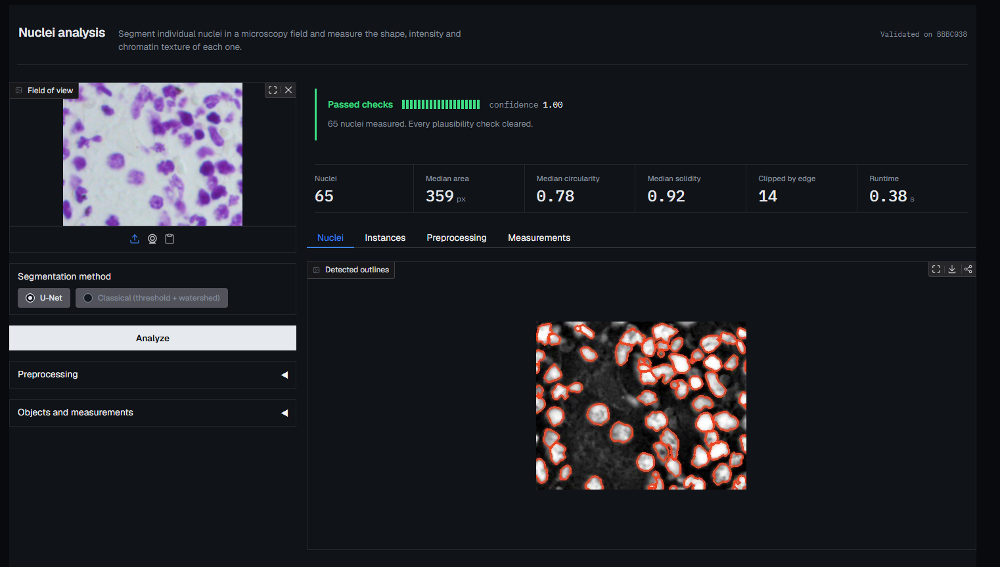

# Nuclei Instance Segmentation for Microscopy

Takes a raw microscopy field and returns quantitative biology: how many nuclei,
how big each one is, how irregular its outline, how bright, and what its
chromatin texture looks like.

```
image → preprocessing → semantic segmentation → instance separation → per-nucleus measurements
```



A classical CV baseline (threshold → morphology → watershed) and a PyTorch
U-Net sit behind one interface, so the learned model is measured against a real
baseline rather than an absent one. Cellpose and SAM are included as optional
benchmarks.

---

## Results

**BBBC038 test split**, 100 held-out images. Same preprocessing, same instance
stage, same metrics — only the segmentation step differs.

| Method | Dice | F1 | **AP** | Count err | s/img |
|---|---|---|---|---|---|
| Classical (Otsu + watershed) | 0.865 | 0.707 | 0.369 | 9.13 | 0.18 |
| U-Net, 1.9M params | 0.874 | 0.775 | **0.478** | **5.19** | 0.28 |
| U-Net, 7.8M params | **0.8765** | **0.779** | **0.480** | 7.73 | 0.16¹ |
| Cellpose 3 `nuclei` (pretrained) | 0.870 | 0.856 | **0.530** | — | 3.29 |
| SAM ViT-B, automatic | 0.656 | 0.533 | 0.260 | — | 56.06 |

¹ the 7.8M model's s/img is on an RTX 3050; every other row is CPU.
Cellpose and SAM rows are the first 50 test images, SAM on 5 at ~1 min/field.

**BBBC039 cross-dataset**, all 200 fields, no fine-tuning — a different
experiment, cell line, microscope and plate.

| Method | Dice | F1 | **AP** | Count err |
|---|---|---|---|---|
| Classical | 0.924 | **0.785** | 0.433 | **10.8** |
| U-Net, 1.9M | **0.934** | 0.770 | **0.452** | 22.0 |
| U-Net, 7.8M | 0.912 | 0.608 | 0.297 | 63.1 |

### Three findings worth the space

**1. Pixel metrics cannot separate these methods; instance metrics can.**
On BBBC038 the three main methods sit within 0.012 Dice of each other while
their AP spans 0.369 to 0.530. Dice says they are equivalent; AP says one is
44% better. Reporting only Dice would have hidden every result below.

**2. The learned model's advantage does not transfer.** In-dataset the U-Net
beats the classical baseline by +0.109 AP. On BBBC039 the same comparison is
+0.019, 95% CI **[−0.002, +0.040]** — indistinguishable from zero (paired over
200 fields, Wilcoxon p = 0.071). BBBC038 mixes fluorescence, brightfield and
histology; most of what the model learned was how to absorb that mix, not a
better notion of a nucleus.

**3. More capacity made transfer worse, not better.** The 7.8M model matches
the 1.9M one in-dataset (AP 0.480 vs 0.478) and collapses off it (0.297 vs
0.452, better on **4 of 200 fields**, p = 5e-34). It predicts 180 nuclei where
there are 118 — its boundary head fires on out-of-distribution texture and
fragments nuclei. Capacity is not the bottleneck here; the 470-image training
set and the boundary-class representation are.

Full tables, robustness sweep, per-image distributions and the distance-head
experiment: **[docs/results.md](docs/results.md)**.

---

## Quickstart

```bash
# CPU-only install; drop the index-url for a CUDA build
pip install torch --index-url https://download.pytorch.org/whl/cpu
pip install -r requirements.txt && pip install -e .

pytest                                    # 261 tests, no dataset needed
python scripts/download_data.py           # BBBC038, ~83 MB
python scripts/prepare_data.py            # cache + splits

python -m microseg.train    --config configs/unet_cpu.yaml
python -m microseg.evaluate --config configs/unet_cpu.yaml --backend unet --split test
python app/gradio_app.py                  # the interface pictured above
```

Analyse your own images:

```bash
python -m microseg.predict --input path/to/images --output results/
```

Every test builds its own synthetic microscopy field, so the suite is hermetic —
no dataset, no checkpoint, no GPU. That is what lets CI run it in a minute.

---

## How it works

**Preprocessing** — hot-pixel removal, illumination flattening, denoising, CLAHE,
percentile normalisation. Order matters: illumination correction before
normalisation, because the reverse bakes the gradient into the scale.

**The central design decision.** The network predicts **three classes** —
background, nucleus *interior*, nucleus *boundary* — not a binary mask. Two
nuclei sharing an edge are one connected component, and no post-processing
recovers that split reliably. Making the boundary its own class gives the
network an explicit incentive to carve a gap, and the watershed floods from
interior seeds so the boundary band is reassigned to whichever nucleus it
borders. Skip that last step and every object loses its rim and every area
measurement is biased low.

**Measurement** — ~70 features per nucleus per channel: morphology (area,
perimeter, circularity, solidity, eccentricity), intensity, and GLCM texture.
Intensity is measured on the *raw* image, never the contrast-enhanced one.

**Quality control** — every result is scored for plausibility (object count,
size distribution, edge clipping) so a bad field is flagged rather than silently
returned.

Also supported: multi-channel images (segment one channel, measure all),
test-time augmentation, an optional distance-regression head, and Docker.
See [docs/](docs/).

---

## Layout

```
src/microseg/     pipeline, models, metrics, analysis
app/              Gradio interface
scripts/          data download, figures, benchmarks, cross-dataset eval
configs/          experiment configs (all share split_seed 42)
tests/            261 tests on synthetic data
docs/             detailed results, multichannel, foundation models
```

## Limitations

- **2-D only.** Z-stacks are max-projected.
- **Cellpose wins on accuracy** (0.530 vs 0.480 AP), being pretrained on far
  more data. The trade is speed — this U-Net is 20× faster on CPU and retrains
  on a new assay in half an hour.
- **Off BBBC038 the U-Net is not better than the classical baseline**, and the
  larger model is clearly worse. For a clean high-density fluorescence assay,
  use the classical backend.
- **Both U-Nets over-segment on unseen data** — the 1.9M model by +12 nuclei per
  field, the 7.8M by +62. More training data, or a flow-field instance
  representation, is the direction; a bigger U-Net is not.
- **No tracking.** Live-cell assays need nuclei linked across frames.

## License

MIT.
